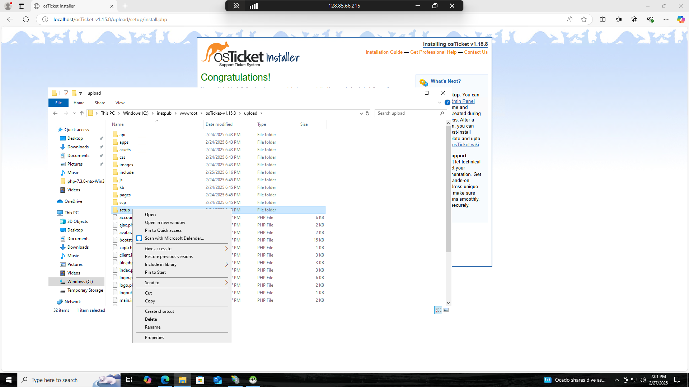

# How to Install osTicket
This is an easy guide to installing a help desk ticketing system called osTicket. 

## Files You Need to Download(if you havent already)

- ### [Download Now](https://drive.google.com/drive/u/2/folders/1APMfNyfNzcxZC6EzdaNfdZsUwxWYChf6) 📁

## Software & Technologies Used

- Windows 10 (Build 19044)
- Microsoft Azure (Virtual Machines)
- Remote Desktop (RDP)
- Internet Information Services (IIS)

## Prerequisites 

- Create a Virtual Machine in Azure
- Install osTicket v1.15.8
- Install HeidiSQL
- Install MySQL
- Install PHP
- install Microsoft Visual C++ Redistributable
  <h2>Steps</h2>
<h3 align="center">Create Virtual Machine in Azure</h3>
 

<h3 align="center">First, start by creating a Resource Group inside Azure.</h3>
 

<h3 align="center">Now, create a Windows 10 Virtual Machine (VM), typically with 2-4 Virtual CPUs. For username and password, it can be anything as we'll be using this info to remote in with our main computer. When creating the Virtual Machine (VM), allow Azure to create a new Virtual Network (Vnet):</h3>
 

 
 
<h3 align="center">Open your Remote Desktop Connection app on your computer and connect to your Virtual Machine that was created in Azure. </h3>
 

	

 
 
<h3 align="center">Now we need to install / Enable IIS in Windows. Go to your Search Bar > Type "Control Panel" > Click "Programs" > "Turn Windows features on or off" > Scroll down to "Internet Information Services (IIS).</h3>
 

	

 

 
 
<h3 align="center">Once clicked, find the "Internet Information Services" expand it and then expand the "World Wide Web" tab. Afterward, expand the application Developer tab. Finally check the "CGI" button & press Ok. You will need CGI to download the PHP Manager. The PHP manager is a back-end web programming language that allows osTicket to run off a web browser.</h3>
 

 
<h3 align="center">Install PHP Manager</h3>
 

<h3 align="center">Download the PHP manager file, and agree with all the terms. We've now downloaded the PHP manager into our operating system.</h3>

 
 

 
<h3 align="center">Install Rewrite Module</h3>
 

<h3 align="center">Download the Rewrite Module file, agree with all the terms and it should now be installed onto the Computer.</h3>

[img IIS rewrite]

 
<h3 align="center">CREATE DIRECTORY C:\PHP</h3>
 

<h3 align="center"> Open File Explorer, type, "C:\" in the search bar, Right-click and create a new folder called, "PHP". Download php-7.3.8-nts-Win32-VC15-x86.zip from<a href="https://drive.google.com/drive/u/2/folders/1APMfNyfNzcxZC6EzdaNfdZsUwxWYChf6"> Files You Need to Download</a>, Extract it by going to where you download the file, Right-click the PHP 7.3.8 file and press extract to the PHP Folder you just created.
</h3>

[install php]
 

 
<h3 align="center">VC_REDIST DOWNLOAD</h3>
 
<h3 align="center"> Download and install VC_Redist, Agree with any terms and agreements and finish installing.
</h3>

  

 
<h3 align="center">DOWNLOAD MySQL </h3>
<h3 align="center"> Download and install MySQL, Agree with any terms and agreements up until you get to the password portion. Here you can create a username and password for the database that you'll be using to store the Ticket Information used in osTicket. 
</h3>

  
 
  (IMG Web platform installer)

 
<h3 align="center">Install osTicket v1.15.8</h3>
 

  Download osTicket (download from within lab files: link).

	Extract and copy the “upload” folder INTO c:\inetpub\wwwroot:

	
 
	(PIC upload folder)

	Within c:\inetpub\wwwroot, Rename “upload” to “osTicket”:

	(PIC 14)

 
 
<h3 align="center">Reload IIS (Open IIS, Stop and Start the server)</h3>
 

	Go to sites -> Default -> osTicket:

 

	On the right, click “Browse *:80”:

 
 
<h3 align="center">Enable Extensions in IIS: Note that some extensions are not enabled</h3>
 

	Go back to IIS, sites -> Default -> osTicket.

	Double-click PHP Manager:

	(PIC 17)

	Click “Enable or disable an extension”.

	Enable: php_imap.dll.

	Enable: php_intl.dll.

	Enable: php_opcache.dll:

 

 
 
<h3 align="center">Refresh the osTicket site in your browser, observe the changes</h3>
 

 

 
 
<h3 align="center">Rename</h3>
 

	From: C:\inetpub\wwwroot\osTicket\include\ost-sampleconfig.php.

	To: C:\inetpub\wwwroot\osTicket\include\ost-config.php:

 
 
<h3 align="center">Assign Permissions: ost-config.php</h3>
 

	Disable inheritance -> Remove All:

	(PIC 21)

	New Permissions -> Everyone -> All:

 

 
 
<h3 align="center">Continue Setting up osTicket in the browser (click Continue)</h3>
 

	Name Helpdesk.

	Default email (receives email from customers):

 
<h3 align="center">Download and Install HeidiSQL</h3>
 

 

	Create a new session, root/Password1.

	Connect to the session:

 

	Create a database called “osTicket”:

 
 
<h3 align="center">Continue Setting up osTicket in the browser</h3>
 

MySQL Database: osTicket

	MySQL Username: root

	MySQL Password: Password1:

	(PIC 29)

Click “Install Now!”

Congratulations, hopefully it is installed with no errors!</hp>

 

 
 
<h3 align="center">Clean up</h3>
 

	Delete: C:\inetpub\wwwroot\osTicket\setup:

 

	Set Permissions to “Read” only: C:\inetpub\wwwroot\osTicket\include\ost-config.php:

 
<h3 align="center">Login to the osTicket Admin Panel (http://localhost/osTicket/scp/login.php)</h3>
 

	

 
 
<h3 align="center"> Congrats, You've Finished Installing osTicket.</h3>
